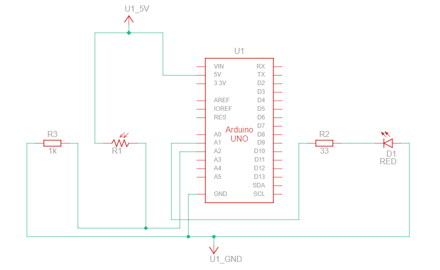

# LI-FI (Light Fidelity)

> WiFi runs our life. In fact, according to a survey carried out by Direct Line by Opinium Research online, it is the number one thing that their respondents couldn’t live without. But no matter where you are in the world, you’ve probably experienced internet connectivity problems at one point or another.

> Enter LiFi, a type of wireless connection that can be up to 100 times faster than WiFi.

## WiFi (Wireless Fidelity) vs. LiFi (Light Fidelity)

| SUBJECT           | WI-FI                                                                               | LI-FI                                                                                                                                          |
|-------------------|-------------------------------------------------------------------------------------|------------------------------------------------------------------------------------------------------------------------------------------------|
| Advantages        | More interference, cannot pass through seawater, works in less dense regions        | Less interference, can pass through salty sea water, works in dense region                                                                     |
| Application       | Used for internet browsing with the help of WiFi hotspots                           | Used in airlines, undersea explorations, operation theaters in the hospitals, office and home premises for data transfer and internet browsing |
| Coverage distance | About 32 meters (WLAN 802.11b/11g), varies based on transmit power and antenna type | Averagely about 10 meters. But can be increased using high powered LED or Laser Modules.                                                       |
| Data density      | Works in less dense environments due to interference related issues                 | Works in high-density environments                                                                                                             |
| Interference      | Several sources of radio interference can disrupt the function of a WiFi network    | Does not have any interference issues similar to radio frequency waves.                                                                        |
| Operation         | WiFi transmits data using radio waves with the help of WiFi router                  | LiFi transmits data using light sources (presently LED bulbs)                                                                                  |
| Privacy           | WiFi is less secure because the signal cannot be blocked by walls and most objects  | With LiFi, light is blocked by the walls and hence will provide more secure data transfer                                                      |

## Setup the bellow diagram twice.

Upload the code to both Arduino. Both of them can transfer and recieve data and display at serial port.